# The link: [images](images)

Your dockerfile. Please provide a link to this file rather than a screen capture.
[Dockerfile](Dockerfile) 
Your running docker instance as shown by a ps command.
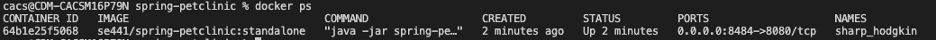
Your browser accessing the main page of the website from your local container.
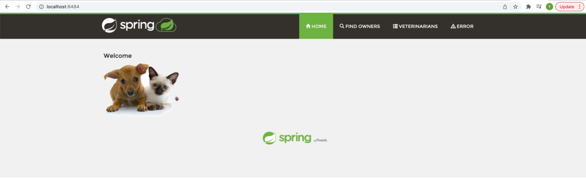
The output from the docker-compose up command.
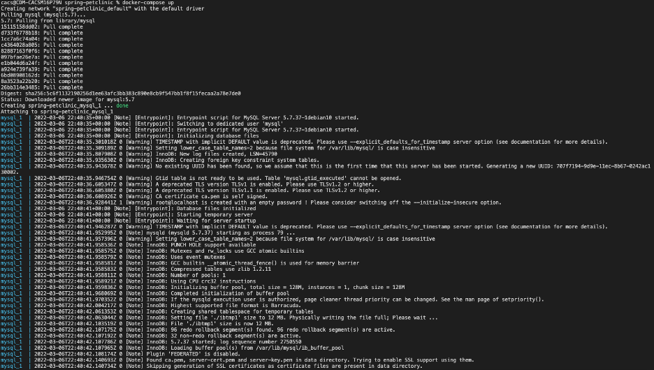
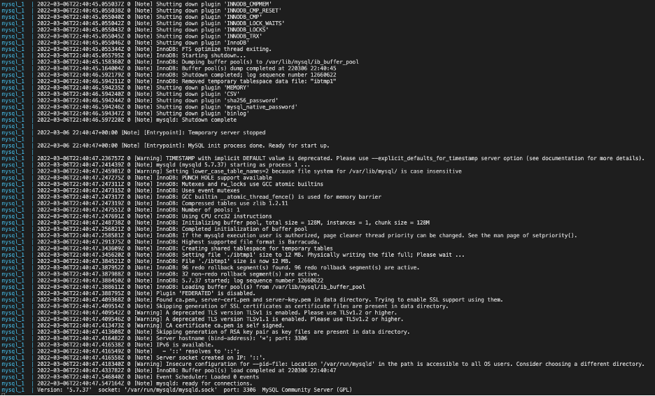
Your browser accessing the “Veterinarians” page of the website from your local container when you run the application from the host system.
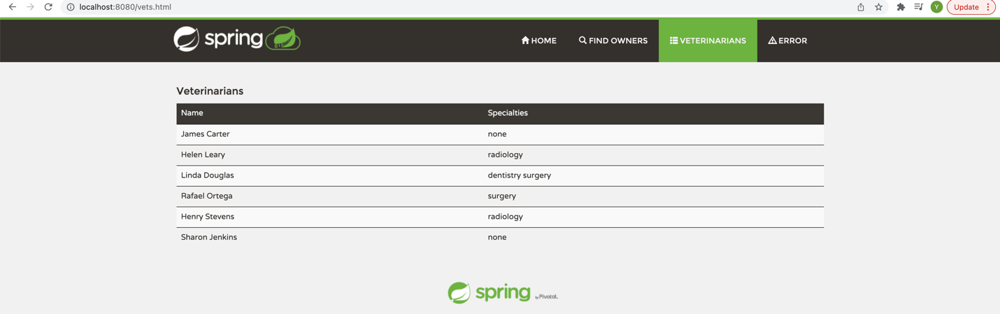
A section of the stack trace generated when you attempt to run the application container that has been updated to use MySQL.
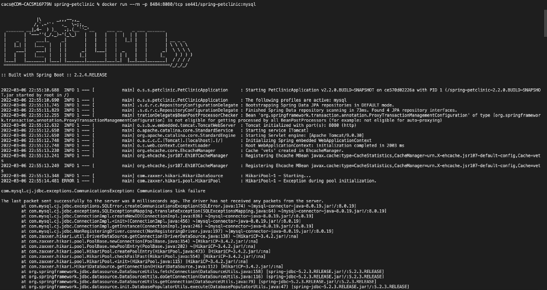
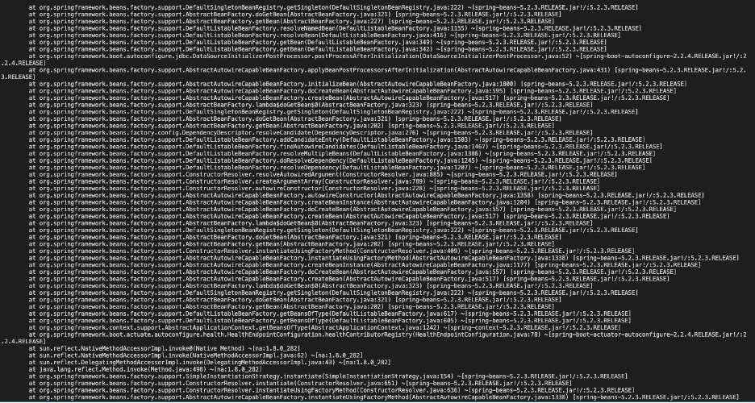
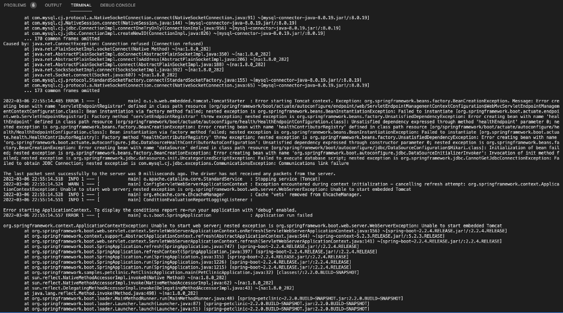
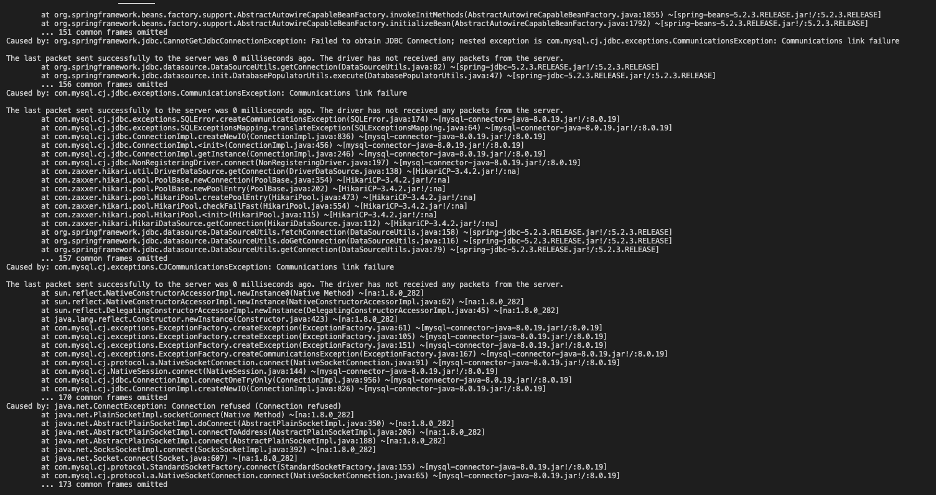
Your updated docker-compose.yml file containing the application server, built from your local Dockerfile, and the existing MySQL configuration. Please provide a link to this file rather than a screen capture.
[docker-compose.yml](docker-compose.yml) 
Your updated application-mysql.properties file containing the URL change for the database server. Please provide a link to this file rather than a screen capture.
[src/main/resources/application-mysql.properties](src/main/resources/application-mysql.properties) 
The output from the docker-compose up command.
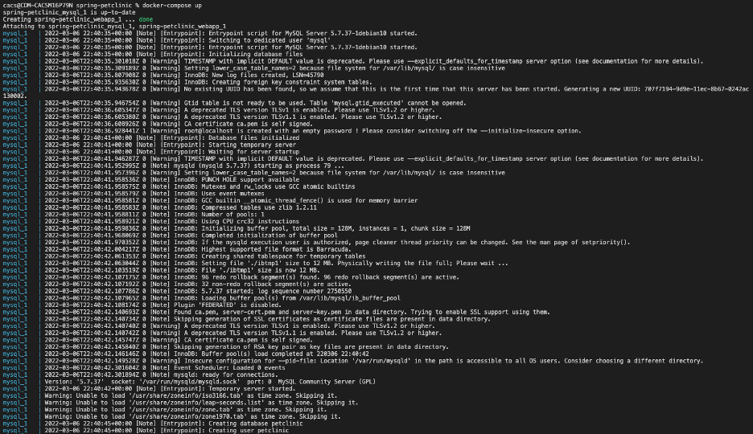
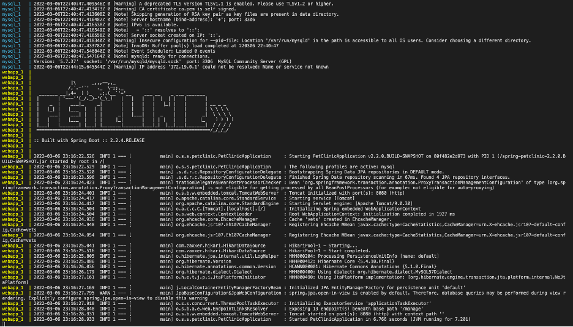
Your browser accessing the “Veterinarians” page of the website from your local con- tainer.
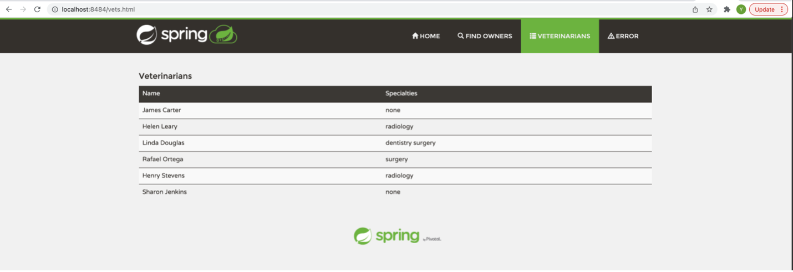
